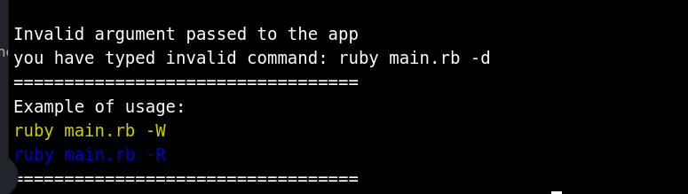
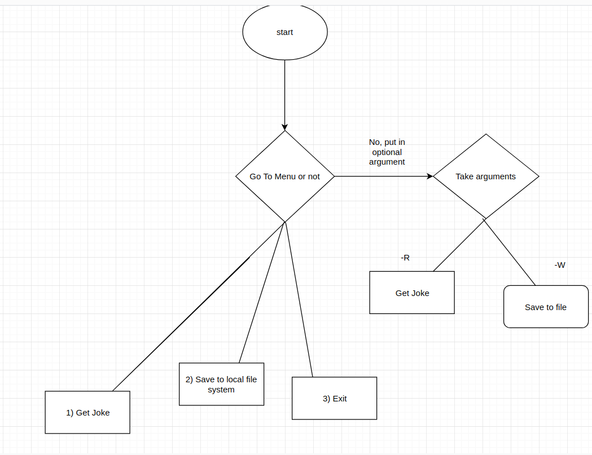

- # Statement of Purpose and Scope

  ## Description of the application

  This is a simple terminal application which allows the user to fetch a random Chuck Norris Joke and allows them to save the joke to a file on the local file system. Chuck Norris has personally approved the application as the legend of Chuck Norris will never die.

  The application relies on ruby runtime as it's not compiled into a binary code.

  ## Identify the issue that it resolves

  This application doesn't resolve anything for the users, it is made with intent to give entertainment with bite size Chuck Norris joke, one at a time.

  I am making this application not with the intent to make money or solving any particular problems faced by me or other people. I made this application to solidify my understanding of Ruby language and also practice the new concepts I have learned in class. The only way to improve coding is through practice and this application has given me plenty of chance to practice writing Ruby codes and markdowns.

  ## Target Audience

  This application is intended for people who have knowledge of operating a terminal in either Linux or Mac environment or for people who can follow the documentations. It's not meant for general Window OS users as I am not sure if this will even run in the Window shell. Also it's mandatory for users to have ruby run time installed with version 2.5.1 or above

  ## How will the audience use it

  The audience will use this application with the guide of the README documentation provided. The documentation will provide information on how to run in dev mode and also in production mode.

  The audience use the application inside a terminal which provides both the output and input

* # Features

  1. Fetch a random Chuck Norris joke from API and displays on Terminal.

     > User to run the command from the terminal
     >
     > The application then makes the outgoing http call to an external API running a loop while we are waiting for the result of the http call
     >
     > Application then store the variable in its local scope then return the result to the main function to be printed on the terminal
     >
     > Extra feature to include when the http call fails, it will use a fallback function to provide the joke

  2. Fetch a random Chuck Norris joke and save to a folder called **"chuck_norris_jokes"** in the current directory, if it's not there it's created on the fly

     > After user select the command, a HTTP call is fired to the API
     >
     > After the call is resolved, we make a file object with the result as the content then we make a directory as specified and then save the file inside the directory
     >
     > if the directory exists, we will just save file in there instead

  3. Run both features from above without going into the app from the CLI with appropriate argument option of either **'-R'** or **'-W'**

     > Same as the features above but instead of running off the menu system in the app
     >
     > The program will just run from command line once and finish

  4. Generate a random string and append the date the file is created to give unique file name

     > a function that generate a random string and append the date as the name of the file to be stored in the local filesystem

  5. Offline support when the fetching api call fails

     > When feature one fails the default hard coded joke function will return a Chuck Norris Joke

- # User interaction and Experience

  - User will find out how to interact with the app by again going through the documentation provided in README.md

  - In the README, there are features listed for the app for user to try it out along with screenshots when they are using each features.

  - User will interact with the features either by selecting a predetermined options or use a valid argument flags for the main application from the terminal.

  - Error handling will be in three main areas: **get a joke** **save to file** and **wrong command line arguments**

    1.  if the get joke feature fails, a fallback joke will be provided so user won't see any error messages.

    2.  if the save file feature fails, user will get an message on the screen indicating that it failed.

    3.  if user enters the wrong argument on the command line, error will be shown like this:

    

- # Control Flow Diagram

  
